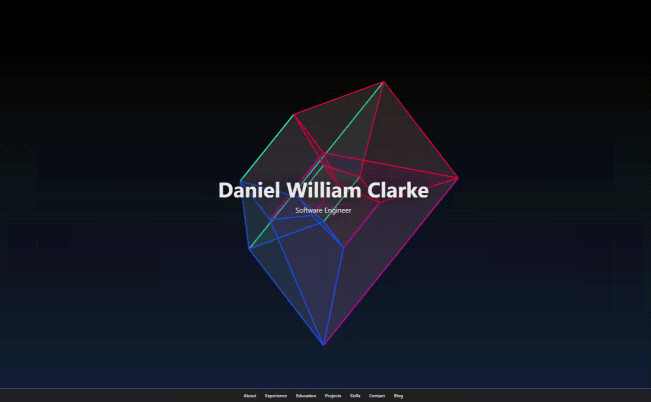

<p align="center">
  
<p>

<p align="center">
  
  
  
  
  
  
  
  
  
<p>

<p align="center">
  A CV/Portfolio/Blog built in <b>TypeScript</b> using <b>React</b>, <b>React PDF</b> and <b>P5JS</b>. with a Rest / GraphQL backend written in <b>Rust</b> using <b>Contentful</b> for portfolio and blog content.
<p/>

<p align="center">
 
<p/>

---

- [Dependencies](#dependencies)
- [Build Service Locally](#build-service-locally)
- [Build Portfolio Locally](#build-portfolio-locally)
- [Build Portfolio Image](#build-portfolio-image)
- [Build Service Image](#build-service-image)
- [Prod Environment](#prod-environment)
- [Add Contentful API IPs to /etc/hosts](#add-contentful-api-ips-to-etchosts)
- [Deploy](#deploy)
- [Redeploy](#redeploy)
- [Teardown](#teardown)
- [// Todo](#-todo)
- [// Done](#-done)
  - [Visualisations](#visualisations)
- [Urls](#urls)
- [Third Parties](#third-parties)
- [Resources](#resources)

---

## Dependencies

- Node
- NPM
- Rust [`Rustup`, `Rustc`, `Cargo`]
- Docker

## Build Service Locally

```bash
# Service
cd service

# Once only
rustup default nightly

# Build Service
cargo build [--release]

# Run Service locally
ACCESS_TOKEN=token SPACE_ID=id ENVIRONMENT=env cargo run [--release]

# Test Service
cargo test [--release]
```

## Build Portfolio Locally

```bash
# Run in WSL or linux
wsl

# Portfolio
cd portfolio

# Install Dependencies
npm install

# Build portfolio
npm run build

# Run Locally
npm run start # Requires service to be up!
```

## Build Portfolio Image

```bash
export DOCKER_HUB_USER_REGISTRY=xyz

# With script
./scripts/build-portfolio.sh $DOCKER_HUB_USER_REGISTRY cujo-portfolio

# OR

# Build with Docker: Dev
docker build -f portfolio/Dockerfile -t $DOCKER_HUB_USER_REGISTRY/cujo-portfolio:latest ./portfolio
# Build with Docker: Prod
docker build -f portfolio/Dockerfile -t $DOCKER_HUB_USER_REGISTRY/cujo-portfolio:latest --build-arg BUILD_MODE=":prod" ./portfolio
# Push image
docker push $DOCKER_HUB_USER_REGISTRY/cujo-portfolio:latest
```

## Build Service Image

```bash
export DOCKER_HUB_USER_REGISTRY=xyz

# With script
./scripts/build-service.sh $DOCKER_HUB_USER_REGISTRY cujo-rust

# OR

# Build with Docker
docker build -f service/Dockerfile -t $DOCKER_HUB_USER_REGISTRY/cujo-rust:latest ./service
# Push image
docker push $DOCKER_HUB_USER_REGISTRY/cujo-rust:latest
```

## Prod Environment

For prod deployment an env file is required with  the following parameters specified

```conf
DOMAIN=localhost

BLOG_HOST=https://cdn.contentful.com
ACCESS_TOKEN=[REDACTED]
SPACE_ID=[REDACTED]
ENVIRONMENT=master

AUTH_URL=[DATA EXPUNGED]
AUTHORITY=[DATA EXPUNGED]
AUDIENCE=[REDACTED]
SELF_REDIRECT=[REDACTED]

PRERENDER_TOKEN=[REDACTED]
PRERENDER_API_URL=https://api.prerender.io/recache
PRERENDER_CACHE_BASE_URL=https://danielclarke.tech
```

## Add Contentful API IPs to /etc/hosts

To save on any potential DNS issues while using the Contentful Content Delivery API

Update the `/etc/hosts` files with all IP addresses for the `cdn.contentful.com` host

```Config
151.101.130.49 cdn.contentful.com
151.101.66.49 cdn.contentful.com
151.101.194.49 cdn.contentful.com
151.101.2.49 cdn.contentful.com
```

IPs subject to change...

## Deploy

```bash
# Run with sudo where necessary

# With script
./scripts/deploy.sh dev(or prod)

# Or ...

# Deploy: Dev
docker-compose -f dev.compose.yaml up

# Deploy: Prod
docker-compose --env-file <SECRET ENV FILE> -f prod.compose.yaml up
```

## Redeploy

```bash
# Run with sudo where necessary

# With script
./scripts/redeploy.sh <DOCKER IMAGE NAME> <CONTAINER NAME> <dev or prod>
```

## Teardown

```bash
# Run with sudo where necessary

# With script
./scripts/teardown dev(or prod) (-v) # to delete volumes

# Or ...

# Teardown: Dev
docker-compose -f dev.compose.yaml down (-v)

# Teardown: Prod
docker-compose --env-file <SECRET ENV FILE> -f prod.compose.yaml down (-v)
```

## // Todo

- [ ] Add Rust code coverage
- [ ] Write front end tests

## // Done

- [x] Swap React class components for React functional components
- [x] Use GraphQL client to frontend
- [x] Add a GraphQL API to backend
- [x] Trigger recache on contentful update
- [x] Get SEO and social media previews to work
- [x] Implement async system design
  - [x] Cujo service now maintains a cache of contentful content
  - [x] Requests from the website now read the cache only
  - [x] Contentful webhooks now call the cujo service on content publish / unpublish
  - [x] We authenticate the webhook POST request agaisnt Auth0
  - [x] Redirect and validate the token so only authenticated clients can trigger a can regenerate the cache
- [x] Generate CV PDF from contentful content
- [x] Add new section to showcase and allow users to download an up to date copy of my CV PDF  
- [x] Write blog
- [x] Add competency levels to skills and visualise
- [x] Move CV fully to Contentful and have backend collect CV data
- [x] Update color scheme to be less dark
- [x] Replace WordPress with Contentful to reduce need to host own content and infrastructure
- [x] Responsive and styled Nav
- [x] Restyle experience and education so they resemble a timeline
- [x] Add auto redeployment of new images pushed for prod
- [x] Create Circle CI build pipeline
- [x] Optimize images (sizes, file encodings - <https://developers.google.com/speed/pagespeed/insights/>)
- [x] Add authentication to wordpress rest api
- [x] Write backend tests
- [x] Get backend service working in prod
- [x] Document backend build and deployment
- [x] Put Blog data access and collation in backend service
- [x] Swap backstretch with a 2d/3d WEBGL canvas visualisation?
- [x] Swap out static file with Rust backend service?
- [x] Formalise colour palette
- [x] Setup SSL correctly.. (ssl-companion is running, it will assign certificates when the window opens again)
- [x] Fix predator/prey image asset
- [x] Finish contact page
- [x] Add site footer
- [x] Proof read profile
- [x] Add asset citations (now using my own images or free stock images only)
- [x] Produce production build for deployment
- [x] Move sharing bar to bottom on mobile devices

### Visualisations

- [x] 3D Box wave
- [x] Waves
- [x] Hexagons
- [x] Phylotaxis
- [x] 4D tesseract projection?
- [x] Conway's game of life

## Urls

- <https://danielclarke.tech> - Portfolio
- <https://danielclarke.tech/blog> - Blog
- <https://danielclarke.tech/cv> - Generate, Show and Download Resume
- <https://danielclarke.tech/api/graphql> - GraphQL API
- <https://danielclarke.tech/api/graphiql> - GraphQL Playground
- <https://danielclarke.tech/api/auth/{endpoint}> - Auth API
- <https://danielclarke.tech/api/regenerate_cv> - CV cache regeneration API
- <https://danielclarke.tech/api/regenerate_blog> - Blog cache regeneration API

## Third Parties

- <https://www.contentful.com/> - Contentful
- <https://auth0.com/> - Auth0
- <https://dashboard.prerender.io/> - Prerender.io

## Resources

- Coding Train - `P5JS` <https://thecodingtrain.com/>
- Lets Get Rusty - `Rust` <https://www.youtube.com/channel/UCSp-OaMpsO8K0KkOqyBl7_w>
- Rust Rest API - `Rust` <https://cloudmaker.dev/how-to-create-a-rest-api-in-rust/>
- Fix Reqwest in Linux - `Rust` <https://stackoverflow.com/questions/52238397/why-does-reqwest-require-an-openssl-installation#52238675>
- Hosting websites using Nginx - `Nginx` <https://blog.harveydelaney.com/hosting-websites-using-docker-nginx/>
- Add Sudoers - `Linux` <https://linuxize.com/post/how-to-add-user-to-sudoers-in-ubuntu/>
- Auto image redeploy with Watchtower - `Docker` <https://alexgallacher.com/setting-up-watchtower-to-update-docker-containers/>
- CircleCI Path filtering - `CircleCI` <https://circleci.com/docs/2.0/using-dynamic-configuration#execute-specific-workflows-or-steps-based-on-which-files-are-modified>
- React scroll spy - `React` <https://makotot.github.io/react-scrollspy/>
- React icons - `React` <https://react-icons.github.io/react-icons/icons?name=io5>
- DevIcons - `React` <https://devicon.dev/>
- Contentful - `CMS` <https://www.contentful.com/>
- Rich Text Renderer - `React` <https://www.npmjs.com/package/@contentful/rich-text-react-renderer>
- Import SCSS variables in Typescript - `SCSS` <https://medium.com/@christian.tonye_16869/scss-variables-in-react-typescript-components-de19d7f96245>
- Circular Progress Bar - `React` <https://github.com/kevinsqi/react-circular-progressbar>
- Generating PDF with React - `React PDF` <https://react-pdf.org/>
  - Rendering a PDF in Canvas - `React PDF`  <https://mozilla.github.io/pdf.js/examples/>
  - How to actually render to a Canvas - `PDFJS` <https://stackoverflow.com/questions/59867174/why-getcontext-function-cannot-be-called-on-react-jsx-canvas-object>
  - Fixing build with PDFJS - `PDFJS` <https://github.com/mozilla/pdf.js/issues/13200>
  - Material Icons png - <https://github.com/material-icons/material-icons-png>
- Auth0 Client Credentials Flow - `Rust` <https://auth0.com/docs/get-started/authentication-and-authorization-flow/call-your-api-using-the-client-credentials-flow>
- Securing Actix Service with Auth0 - `Rust` <https://auth0.com/blog/build-an-api-in-rust-with-jwt-authentication-using-actix-web/#Securing-the-API>
- Generate Prerendered pages with Prerender - <https://github.com/prerender/prerender-nginx>
- Triggering a reache with Prerender - <https://docs.prerender.io/v1/docs/en/6-api>
- Ubuntu does not cache DNS records - <https://www.cloudns.net/blog/dns-cache-explained/>
- Async GraphQL Crate - `Rust` <https://github.com/async-graphql/async-graphql>
  - Async GraphQL tutorial - `Rust` <https://romankudryashov.com/blog/2020/12/graphql-rust/>
  - Async GraphQL book - `Rust` <https://async-graphql.github.io/async-graphql/en/introduction.html>
- GraphQL Client load GQL files - `GraphQL` <https://github.com/apollographql/graphql-tag/issues/42>
  - Craco Plugin - `GraphQL`  <https://www.npmjs.com/package/craco-graphql-loader>
- GraphQL Request - `GraphQL`  <https://github.com/prisma-labs/graphql-request>
- GZipping bundles to load page faster - `GZip` <https://stackoverflow.com/questions/55704772/how-to-compress-build-with-without-ejecting-create-react-app-also-include-compr>
- React Icons Tree shaking doesn't work - `React` <https://github.com/react-icons/react-icons/issues/289>
  - Styled Icons to the rescue <https://github.com/styled-icons/styled-icons>